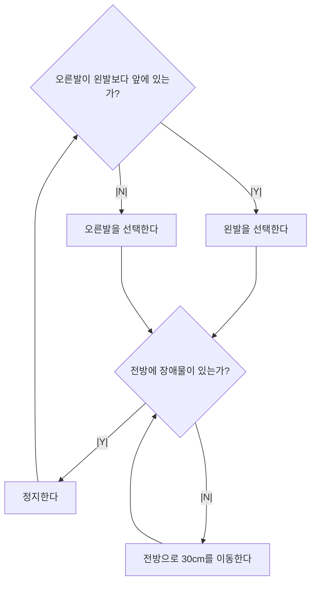
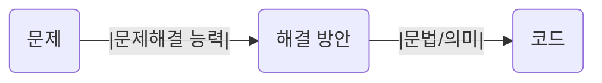

# 1. 프로그래밍

## 1. 프로그래밍이란?

> 프로그래밍이란, 컴퓨터가 실행할 수 있을 정도로 정확하고 상세하게 요구사항을 설명하여 실행을 요구하는 커뮤니케이션이다.

- 현실 세계에서 사용되는 본질의 추상적인 개념을 컴퓨터가 계산할 수 있도록 만든다.
- 컴퓨터와 사람은 인지 방식이 다르기 때문에 과제를 작은 단위로 분해하고 패턴화하며 평가 가능하도록 정의해야 한다.



> 2족 보행 로봇의 디자인.
> '걷다'라는 기능을 디자인 하기위해 판단해야 하는 상태, 판단 시기, 판단 기준을 정의해야 하고,
> 이를 바탕으로 분해한 프로세스의 실행 여부를 결정한다.

## 2. 프로그래밍 언어

> 사람이 기계어를 이해해서 기계어로 직접 명령을 전달하는 것은 매우 어려운 일이다.
> 사람이 이해할 수 있는 약속된 구문(syntax)로 구성된 프로그래밍 언어를 이용한다.

- 컴파일러(compiler):
- 인터프리터(interpreter): 

```mermaid
flowchart LR
    human((사람))
    complier((컴파일러))
    computer((컴퓨터))
    human --|프로그래밍 언어|-- complier
    complier --|기계어|-- computer
```

> 프로그래밍 언어는 구문(syntax)와 의미(semantics)의 조합으로 표현된다.

## 3. 구문과 의미

> 문법에 맞는 문장을 구성하는 것은 물론 의미를 가지고 있어야 언어의 역할을 충실히 수행할 수 있다.

- 문제 해결 능력을 통해 만들어낸 해결 방안은 프로그래밍 언어의 문법을 사용해 표현.
- 즉 작성된 코드는 해결 방안의 구체적 구현물임.



> 결국 프로그래밍은
> 요구사항의 집합을 분석해서
> 적절한 자료구조와 함수의 집합으로 변환한 후
> 그 흐름을 제어하는 것.
