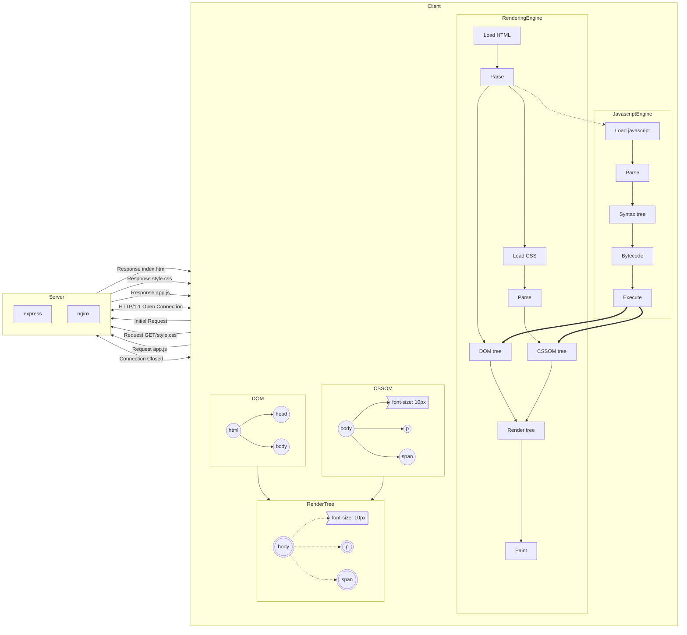
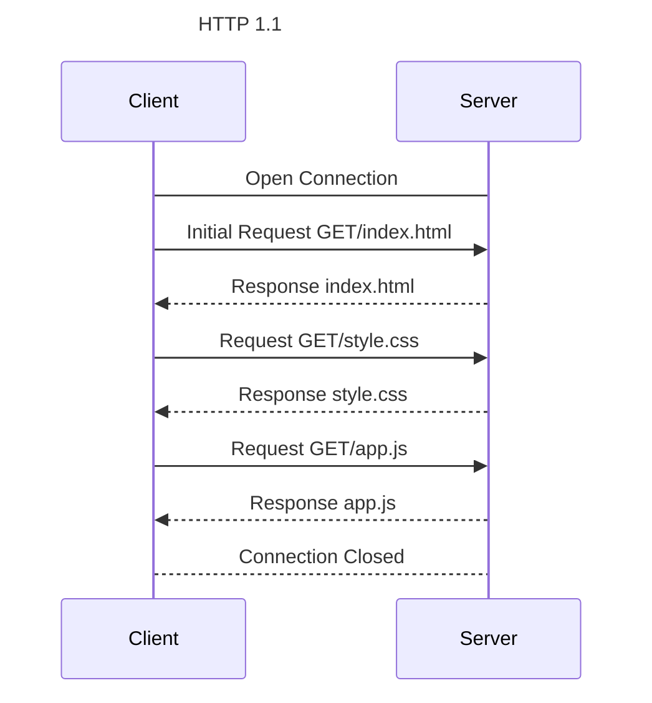
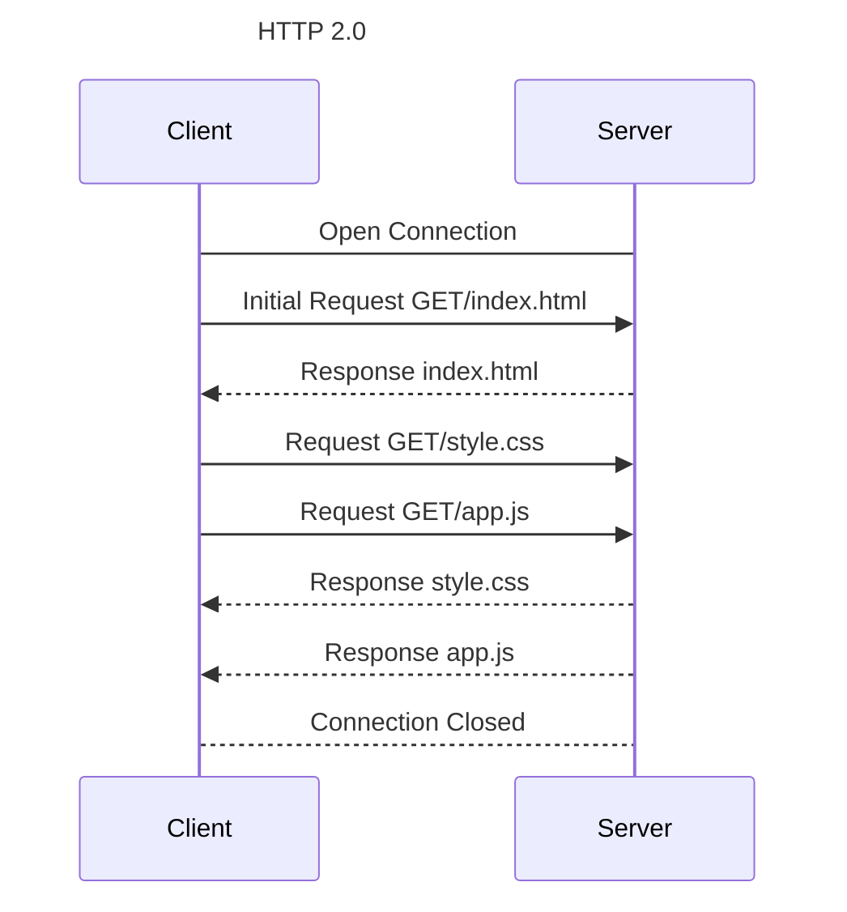
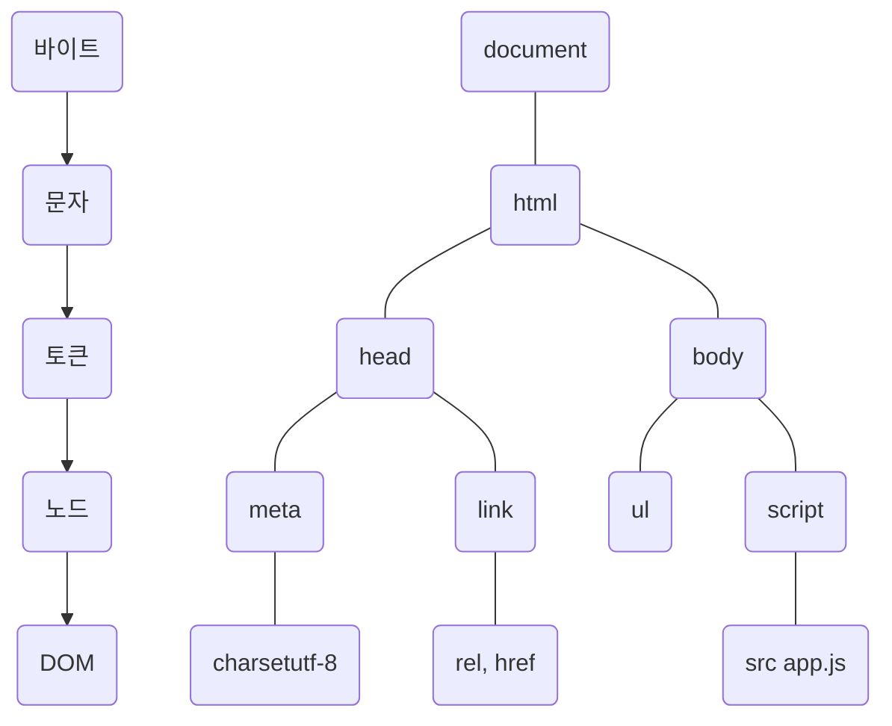

# 38. 브라우저의 렌더링 과정

> 구글의 v8 자바스크립트 엔진으로 빌드된 자바스크립트 런타임 환경인 Node.js의 등장으로 자바스크립트는 웹 브라우저를 벗어나 서버 사이드 애플레이케이션 개발에서도 사용할 수 있는 범용 개발 언어가 되었다.  
> 하지만 자바스크립트가 가장 많이 사용되는 분야는 웹 브라우저 환경에서 동작하는 웹페이지/애플리케이션의 클라이언트 사이드다.  
> 브라우저가 HTML, CSS, 자바스크립트로 작성된 텍스트 문서를 어떻게 파싱(해석)하여 브라우저에 렌더링하는지 살펴보자.

- 파싱(parsing): 프로그래밍 언어의 문법에 맞게 작성된 텍스트 문서를 읽어 들여 실행하기 위해 텍스트 문서의 문자열을 토큰으로 분해하고, 토큰에 문법적 의미와 구조를 반영하여 트리 구조의 자료구조인 파스 트리를 생성하는 일련의 과정.
- 렌더링(rendering): HTML, CSS, 자바스크립트로 작성된 문서를 파싱하여 브라우저에 시각적으로 출력하는 것.

브라우저는 다음과 같은 과정을 거쳐 렌더링을 수행한다.

1. 브라우저는 HTML, CSS, Javascript, image, fontFile 등 렌더링에 필요한 리소스를 요청하고 서버로부터 응답을 받는다.
2. 브라우저의 렌더링 엔진은 서버로부터 응답된 HTML과 CSS를 파싱하여 DOM과 CSSOM을 생성하고 이들을 결합하여 렌더 트리를 생성한다.
3. 브라우저의 자바스크립트 엔진은 서버로부터 응답된 Javascript를 파싱하여 AST(Abstract Syntax Tree)를 생성하고 바이트코드로 변환하여 실행한다. 이때 자바스크립트는 DOM API를 통해 DOM이나 CSSOM을 변경할 수 있다. 변경된 DOM과 CSSOM은 다시 렌더 트리로 결합된다.
4. 렌더트리를 기반으로 HTML 요소의 레이아웃(위치와 크기)을 계산하고 브라우저 화면에 HTML 요소를 페인팅한다.

## 38-1. 요청과 응답

> 브라우저의 핵심 기능은 필요한 리소스를 서버에 요청하고 서버로부터 응답받아 브라우저에 시각적으로 렌더링하는 것이다.  
> 렌더링에 필요한 리소스는 모두 서버에 존재하므로 필요한 리소스를 서버에 요청하고 서버가 응답한 리소스를 파싱하여 렌더링하는 것.

- 요청과 응답은 개발자 도구의 network 패널에서 확인할 수 있다.
- 브라우저의 렌더링 엔진이 HTML을 파싱하는 도중에 외부 리소스를 로드하는 태그들을 만나면 파싱을 일시 중단하고 해당 리소스 파일을 서버로 요청한다.

## 38-2. HTTP 1.1과 HTTP 2.0

- HTTP 1.1: 커넥션 당 하나의 요청과 응답만 처리.
- 리소스 요청이 개별적으로 전송되고 응답 또한 개별적으로 전송.
- 리소스의 동시 전송이 불가능한 구조이므로 요청할 리소스의 개수에 비례하여 응답 시간도 증가하는 단점이 있음.

- HTTP 2.0: 커넥션 당 여러 개의 요청과 응답, 다중 요청/응답이 가능.
- 여러 리소스의 동시 전송이 가능하므로 페이지 로드 속도가 50% 정도 빠르다.

## 38-3. HTML 파싱과 DOM 생성

> 브라우저의 요청에 의하여 서버가 응답한 HTML문서는 문자열로 이루어진 순수한 텍스트이다. 순수한 텍스트인 HTML 문서를 브라우저에 시각적인 픽셀로 렌더링하려면 HTML 문서를 브라우저가 이해할 수 있는 자료구조(객체)로 변환하여 메모리에 저장해야 한다.  

1. 서버에 존재하던 HTML파일이 브라우저의 요청에 의해 응답된다. 이때 서버는 브라우저가 요청한 HTML 파일을 읽어 들여 메모리에 저장한 다음 메모리에 저장된 바이트(2진수)를 인터넷을 경유하여 응답한다.
2. 브라우저는 서버가 응답한 HTML문서를 바이트(2진수) 형태로 응답받는다. 그리고 응답된 바이트 형태의 HTML문서는 meta 태그의 charset 어트리뷰트에 의해 지정된 인코딩 방식을 기준으로 문자열로 변환된다. 응답 헤더에 인코딩 방식에 따라 content-type이 담겨 응답된다.
3. 문자열로 변환된 HTML 문서를 읽어 들여 문법적 의미를 갖는 코드의 최소 단위인 **토큰**들로 분해한다.
4. 각 토큰들을 객체로 변환하여 **노드**를 생성한다. 토큰의 내용에 따라 문서 노드, 요소 노드, 어트리뷰트 노드, 텍스트 노드가 생성된다. 이후 노드는 DOM을 구성하는 기본 요소가 된다.
5. HTML 문서는 HTML요소들의 집합으로 이루어지며 **HTML 요소는 중첩관계를 갖는다.** HTML 요소의 콘텐츠 영역에는 텍스트뿐만 아니라 다른 HTML 요소도 포함될 수 있다. 이때 HTML요소 간에는 중첩 관계에 의해 부자 관계가 형성된다. 이러한 HTML 요소 간의 부자 관계를 반영하여 모든 노드들을 **트리 자료구조**로 구성한다. 이 노드들로 구성된 트리 자료구조를 DOM(Document Object Model)이라 부른다.

- 즉 **DOM은 HTML 문서를 파싱한 결과물이다.**

## 38-4. CSS 파싱과 CSSOM 생성

- 렌더링 엔진은 코드를 한 줄씩 순차적으로 파싱하여 DOM을 생성해 나간다.
- CSS를 로드하는 태그를 만나면 DOM생성을 일시 중단한다.
- 태그의 style.css파일을 서버에 요청하여 동인한 파싱 과정(바이트->문자->토큰->노드->CSSOM)을 거치며 해석하여 **CSSOM(CSS Object Model)**을 생성한다.
- 이후 CSS 파싱을 완료하면 HTML파싱이 중단된 지점부터 다시 HTML을 파싱하기 시작하여 DOM 생성을 재개한다.

## 38-5. 렌더 트리 생성

> 렌더링 엔진은 서버로부터 응답된 HTML과 CSS를 파싱하여 각각 DOM과 CSSOM를 생성한다. 그리고 DOM과 CSSOM은 렌더링을 위해 **렌더 트리(Render tree)로 결합된다.  
> 렌더 트리는 브라우저 화면에 렌더링 되는 노드만으로 구성된다.

- 이후 완성된 렌더 트리는 각 HTML요소의 레이아웃(위치와 크기)을 계산하는 데 사용되며 브라우저 화면에 픽셀을 렌더링하는 페인팅 처리에 입력된다.
