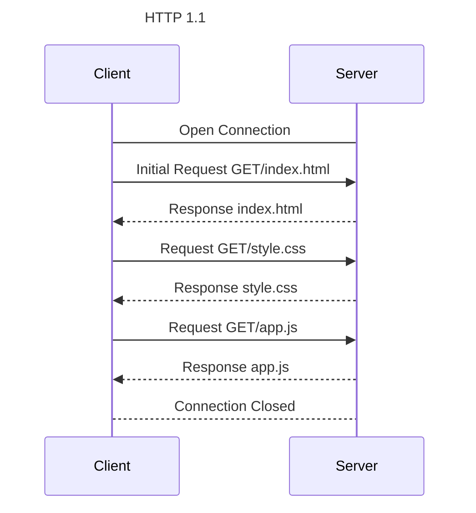
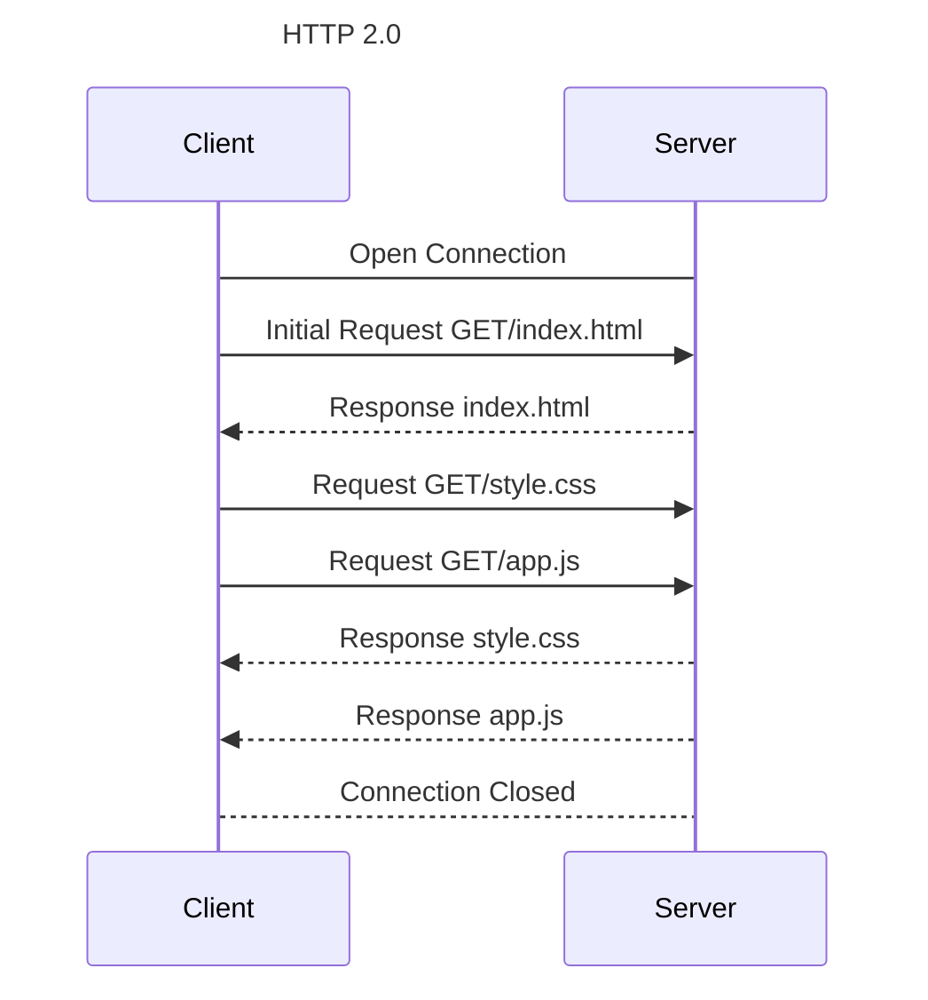
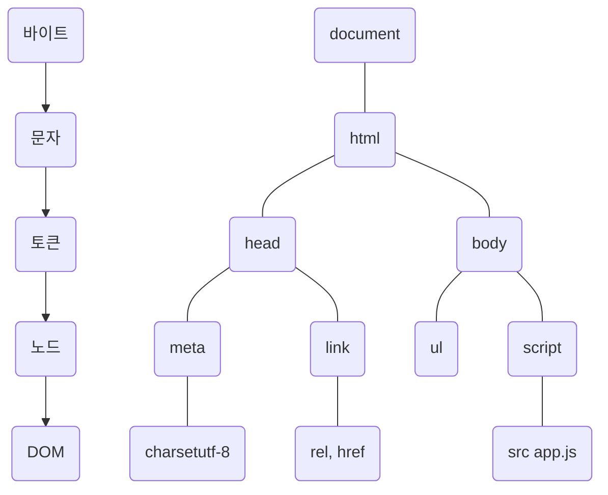
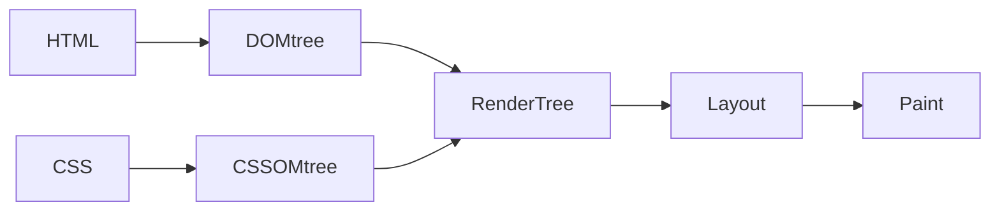
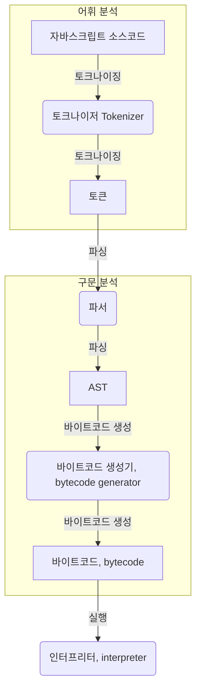

# 38. 브라우저의 렌더링 과정

> 구글의 v8 자바스크립트 엔진으로 빌드된 자바스크립트 런타임 환경인 Node.js의 등장으로 자바스크립트는 웹 브라우저를 벗어나 서버 사이드 애플레이케이션 개발에서도 사용할 수 있는 범용 개발 언어가 되었다.  
> 하지만 자바스크립트가 가장 많이 사용되는 분야는 웹 브라우저 환경에서 동작하는 웹페이지/애플리케이션의 클라이언트 사이드다.  
> 브라우저가 HTML, CSS, 자바스크립트로 작성된 텍스트 문서를 어떻게 파싱(해석)하여 브라우저에 렌더링하는지 살펴보자.

- 파싱(parsing): 프로그래밍 언어의 문법에 맞게 작성된 텍스트 문서를 읽어 들여 실행하기 위해 텍스트 문서의 문자열을 토큰으로 분해하고, 토큰에 문법적 의미와 구조를 반영하여 트리 구조의 자료구조인 파스 트리를 생성하는 일련의 과정.
- 렌더링(rendering): HTML, CSS, 자바스크립트로 작성된 문서를 파싱하여 브라우저에 시각적으로 출력하는 것.

브라우저는 다음과 같은 과정을 거쳐 렌더링을 수행한다.

1. 브라우저는 HTML, CSS, Javascript, image, fontFile 등 렌더링에 필요한 리소스를 요청하고 서버로부터 응답을 받는다.
2. 브라우저의 렌더링 엔진은 서버로부터 응답된 HTML과 CSS를 파싱하여 DOM과 CSSOM을 생성하고 이들을 결합하여 렌더 트리를 생성한다.
3. 브라우저의 자바스크립트 엔진은 서버로부터 응답된 Javascript를 파싱하여 AST(Abstract Syntax Tree)를 생성하고 바이트코드로 변환하여 실행한다. 이때 자바스크립트는 DOM API를 통해 DOM이나 CSSOM을 변경할 수 있다. 변경된 DOM과 CSSOM은 다시 렌더 트리로 결합된다.
4. 렌더트리를 기반으로 HTML 요소의 레이아웃(위치와 크기)을 계산하고 브라우저 화면에 HTML 요소를 페인팅한다.

## 38-1. 요청과 응답

> 브라우저의 핵심 기능은 필요한 리소스를 서버에 요청하고 서버로부터 응답받아 브라우저에 시각적으로 렌더링하는 것이다.  
> 렌더링에 필요한 리소스는 모두 서버에 존재하므로 필요한 리소스를 서버에 요청하고 서버가 응답한 리소스를 파싱하여 렌더링하는 것.

- 요청과 응답은 개발자 도구의 network 패널에서 확인할 수 있다.
- 브라우저의 렌더링 엔진이 HTML을 파싱하는 도중에 외부 리소스를 로드하는 태그들을 만나면 파싱을 일시 중단하고 해당 리소스 파일을 서버로 요청한다.

## 38-2. HTTP 1.1과 HTTP 2.0

- HTTP 1.1: 커넥션 당 하나의 요청과 응답만 처리.
- 리소스 요청이 개별적으로 전송되고 응답 또한 개별적으로 전송.
- 리소스의 동시 전송이 불가능한 구조이므로 요청할 리소스의 개수에 비례하여 응답 시간도 증가하는 단점이 있음.

- HTTP 2.0: 커넥션 당 여러 개의 요청과 응답, 다중 요청/응답이 가능.
- 여러 리소스의 동시 전송이 가능하므로 페이지 로드 속도가 50% 정도 빠르다.

## 38-3. HTML 파싱과 DOM 생성

> 브라우저의 요청에 의하여 서버가 응답한 HTML문서는 문자열로 이루어진 순수한 텍스트이다. 순수한 텍스트인 HTML 문서를 브라우저에 시각적인 픽셀로 렌더링하려면 HTML 문서를 브라우저가 이해할 수 있는 자료구조(객체)로 변환하여 메모리에 저장해야 한다.  

1. 서버에 존재하던 HTML파일이 브라우저의 요청에 의해 응답된다. 이때 서버는 브라우저가 요청한 HTML 파일을 읽어 들여 메모리에 저장한 다음 메모리에 저장된 바이트(2진수)를 인터넷을 경유하여 응답한다.
2. 브라우저는 서버가 응답한 HTML문서를 바이트(2진수) 형태로 응답받는다. 그리고 응답된 바이트 형태의 HTML문서는 meta 태그의 charset 어트리뷰트에 의해 지정된 인코딩 방식을 기준으로 문자열로 변환된다. 응답 헤더에 인코딩 방식에 따라 content-type이 담겨 응답된다.
3. 문자열로 변환된 HTML 문서를 읽어 들여 문법적 의미를 갖는 코드의 최소 단위인 **토큰**들로 분해한다.
4. 각 토큰들을 객체로 변환하여 **노드**를 생성한다. 토큰의 내용에 따라 문서 노드, 요소 노드, 어트리뷰트 노드, 텍스트 노드가 생성된다. 이후 노드는 DOM을 구성하는 기본 요소가 된다.
5. HTML 문서는 HTML요소들의 집합으로 이루어지며 **HTML 요소는 중첩관계를 갖는다.** HTML 요소의 콘텐츠 영역에는 텍스트뿐만 아니라 다른 HTML 요소도 포함될 수 있다. 이때 HTML요소 간에는 중첩 관계에 의해 부자 관계가 형성된다. 이러한 HTML 요소 간의 부자 관계를 반영하여 모든 노드들을 **트리 자료구조**로 구성한다. 이 노드들로 구성된 트리 자료구조를 DOM(Document Object Model)이라 부른다.

- 즉 **DOM은 HTML 문서를 파싱한 결과물이다.**

## 38-4. CSS 파싱과 CSSOM 생성

- 렌더링 엔진은 코드를 한 줄씩 순차적으로 파싱하여 DOM을 생성해 나간다.
- CSS를 로드하는 태그를 만나면 DOM생성을 일시 중단한다.
- 태그의 style.css파일을 서버에 요청하여 동인한 파싱 과정(바이트->문자->토큰->노드->CSSOM)을 거치며 해석하여 **CSSOM(CSS Object Model)**을 생성한다.
- 이후 CSS 파싱을 완료하면 HTML파싱이 중단된 지점부터 다시 HTML을 파싱하기 시작하여 DOM 생성을 재개한다.

## 38-5. 렌더 트리 생성

> 렌더링 엔진은 서버로부터 응답된 HTML과 CSS를 파싱하여 각각 DOM과 CSSOM를 생성한다. 그리고 DOM과 CSSOM은 렌더링을 위해 **렌더 트리(Render tree)로 결합된다.  
> 렌더 트리는 브라우저 화면에 렌더링 되는 노드만으로 구성된다.

- 이후 완성된 렌더 트리는 각 HTML요소의 레이아웃(위치와 크기)을 계산하는 데 사용되며 브라우저 화면에 픽셀을 렌더링하는 페인팅 처리에 입력된다.

다음과 같은 경우 반복해서 레이아웃 계산과 페인팅이 재차 실행된다.

- 자바스크립트에 의한 노드 추가 또는 삭제
- 브라우저 창의 리사이징에 의한 뷰포트 크기 변경
- HTML 요소의 레이아웃에 변경을 발생시키는 width/height, margin, padding, boarder, display, position, top/right/botton/left 등의 스타일 변경

레이아웃 계산과 페인팅을 다시 실행하는 리렌더링은 성능에 악영향을 주는 작업이다. 가급적 리렌더링이 빈번하게 발생하지 않도록 주의할 필요가 있다.

## 8-6. 자바스크립트 파싱과 실행

자바스크립트 코드에서 DOM API를 사용하면 이미 생성된 돔을 동적으로 조작할 수 있다.
css 파싱 과정과 마찬가지로 렌더링 엔진은 html을 한 줄씩 순차적으로 파싱하며 dom을 생성해 나가다가 자바스크립트 파일을 로드하는 script태그나 자바스크립트 코드를 콘텐츠로 담은 script 태그를 만나면 dom 생성을 일시 중단한다.

그리고 script 태그 내의 src 어트리뷰트에 정의된 파일을 서버에 요청하여 자바스크립트 엔진에 제어권을 넘긴다.
자바스크립트 파싱과 실행은 브라우저의 렌더링 엔진이 아닌 자바스크립트 엔진이 처리한다.

자바스크립트 엔진은 자바스크립트 코드를 파싱하여 cpu가 이해할 수 있는 저수준 언어로 변환하고 실행하는 역할을 한다. 
자바스크립트 엔진은 자바스크립트를 해석하여 **AST(Abstract Syntax Tree, 추상적 구문 트리)**를 생성한다.

그리고 AST를 기반으로 인터프리터가 실행할 수 있는 중간 코드(intermediate code)인 바이트코드를 생성하여 실행한다.

- 토크나이징(tokenizing): 단순한 문자열인 자바스크립트 소스코드를 어휘 분석하여 문법적 의미를 갖는 코드의 최소 단위인 토큰들로 분해한다.
- 파싱(parsing): 토큰들의 집합을 구문 분석하여 AST를 생성한다. AST는 토큰에 문법적 의미와 구조를 반영한 트리 구조의 자료구조다.
- AST를 사용하면 typescript, babel, prettier 같은 트랜스파일러를 구현할 수도 있다.

- v8 엔진의 경우, 자주 사용되는 코드는 터보팬이라 불리는 컴파일러에 의해 최적화된 머신코드로 컴파일되어 성능을 최적화한다.
- 코드의 사용 빈도가 적어지면 다시 디옵티마이징하기도 한다.

## 38-7. 리플로우와 리페인트

- 자바스크립트 코드에 DOM이나 CSSOM을 변경하는 DOM API가 사용된 경우 다시 렌더 트리로 결합되고 변경된 렌더 트리를 기반으로 레이아웃과 페인트 과정을 거쳐 브라우저의 화면에 다시 렌터링 한다.
- 리플로우는 레이아웃 계산을 다시 하는 것이고 노드 추가/삭제, 요소의 크기/위치 변경, 윈도우 리사이징 등 레이아웃에 영향을 주는 변경이 발생한 경우에 한하여 실행된다.
- 리페인트는 재결합된 렌더 트리를 기반으로 다시 페인트하는 것을 말한다.
- 레이아웃에 영향이 없는 변경은 리플로우 없이 리페인트만 실행된다.

## 38-8. 자바스크립트 파싱에 의한 html 파싱 중단

렌더링 엔진과 자바스크립트 엔진은 병렬적으로 파싱을 실행하지 않고 직렬적으로 파싱을 수행한다.
- script 태그의 위치에 따라 html 파싱이 블로킹되어 dom 생성이 지연될 수 있다는 것을 의미한다. script 태그의 위치는 중요한 의미를 갖는다.
- 자바스크립트 코드에서 dom이나 cssom을 변경하는 dom api가 사용될 경우 dom이 생성되지 않은 상태라면 문제가 발생한다.
- 이러한 문제를 피하기 위해 body 요소 가장 아래에 자바스크립트를 위치시키는 것은 좋은 아이디어이다.
- dom이 완성되지 않은 상태에서 자바스크립트가 dom을 조작하면 에러가 발생할 수 있다.
- 자바스크립트 로딩/파싱/실행으로 인해 html 요소들의 렌더링에 지장받는 일이 발생하지 않아 페이지 로딩 시간이 단축된다.
- 자바스크립트가 실행되기 전에 dom 생성이 완성되어 렌더링되면 페이지 로딩 시간이 단축되는 이점도 있다.

## 38-9. script 태그의 async/defer 어트리뷰트

> html5부터 js 파싱에 의해 dom 생성이 중단되는 문제를 근본적으로 해결하기 위해 async과 defer 어트리뷰트가 추가되었다.  
> src 어트리뷰트를 통해 외부 자바스크립트 파일을 로드하는 경우에만 사용할 수 있다. (인라인 자바스크립트에는 사용할 수 없다.)

### async 어트리뷰트

html 파싱과 외부 자바스크립트 파일의 로드가 비동기적으로 동시에 진행된다. 단, 자바스크립트의 파싱과 실행은 자바스크립트 파일의 로드가 완료된 직후 진행되며, 이때 html 파싱이 중단된다.
여러 개의 script 태그에 async 어트리뷰트를 지정하면 태그 순서에 상관없이 로드가 완료된 자바스크립트부터 먼저 실행되므로 순서가 보장되지 않는다.

### defer 어트리뷰트

html 파싱과 외부 자바스크립트 파일의 로드가 비동기적으로 동시에 진행된다.  
자바스크립트의 파싱과 실행은 html 파싱이 완료된 직후, dom 생성이 완료된 직후에 진행된다.  
dom 생성 이후에 실행되어야 할 자바스크립트에 유용하다.
