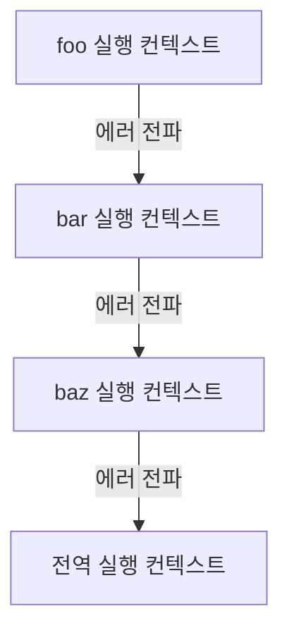

# 47. 에러 처리

## 47-1. 에러 처리의 필요성

- 에러가 발생하지 않는 코드를 작성하는 것은 불가능하다.
- 에러는 언제나 발생할 수 있으며 에러에 대해 대처하지 않으면 프로그램은 강제 종료된다.

```javascript
console.log('[start]')

foo() // ReferenceError: foo is not defined
// 발생한 에러를 방치하면 프로그램은 강제 종료된다.

// 에러에 의해 프로그램이 강제 종료되어 아래 코드는 실행되지 않는다.
console.log('[end]')
```

- try...catch 문을 사용해 발생한 에러에 적절하게 대응하면 프로그램이 강제종료 되지 않고 계속해서 코드를 실행시킬 수 있다.

```javascript
console.log('[start]')

try {
  foo()
} catch (error) {
  console.error('[에러발생]', error)
  // [에러발생] ReferenceError: foo is not defined
}
// 발생한 에러에 적절한 대응을 하면 프로그램이 강제 종료되지 않는다.
console.log('[end]')
```

- 예외적인 상황에 적절하게 대응하지 않으면 에러로 이어진다.

```javascript
// DOM에 button 요소가 존재하지 않으면 querySelector 메서드는 에러를 발생 시키지 않고 null을 반한한다.
const $button = document.querySelector('button') // null

$button.classList.add('disabled')
// TypeError: Cannot read property 'classList' of null

/*
  위 예제의 querySelector 메서드는 인수로 전달한 문자열이 css 선택자 문법에 맞지 않는 경우 에러를 발생.
*/

const $elem = document.querySelector('#1')
// DOMException: Failed to excute 'querySelector' on 'Domcument': '#1' is not a vaild selector.

/*
  하지만 querySelector 메서드는 인수로 전달한 css 선택자 문자열로 DOM에서 요소 노드를 찾을 수 없는 경우 에러를 발생시키지 않고
  null을 반환한다.
  이때 if 문으로 반환값을 확인하거나 단축 평가 또는 옵셔널 체이닝 연산자 ?. 를 사용하지 않으면 다음 처리에서 에러로 이어질 가능성이 크다.
*/

// DOM에 button 요소가 존재하지 않으면 querySelector 메서드는 에러를 발생 시키지 않고 null을 반한한다.
const $button = document.querySelector('button') // null
$button?.classList.add('disabled')
```

- 에러나 예외적인 상황에 대응하지 않으면 프로그램은 강제 종료될 것이다.
- 언제나 에러나 예외적인 상황이 발생할 수 있다는 것을 전제하고 이에 대응하는 코드를 작성하는 것이 중요.

## 47-2. try...catch...finally문

에러 처리방법은 두 가지가 있는데,

1. 예외적인 상황이 발생하면 반환하는 값(null | -1)을 if 문이나 단축 평가 또는 옵셔널 체이닝 연산자를 통해 확인해서 처리하는 방법
2. 에러 처리 코드를 미리 등록해 두고 에러가 밸상하면 에러 처리 코드로 점프하도록 하는 방법

- try...catch문은 두 번째 방법으로, 일반적으로 이 방법을 에러 처리라고 한다.
- finally 문은 불필요하다면 생략 가능.
- catch 문도 생략 가능이지만 catch 문 없는 try 문은 의미가 없다.

```javascript
try {
  // 실행할 코드(에러가 발생할 가능성이 있는 코드)
} catch (err) {
  // try 코드 블록에서 에러가 발생하면 이 코드 블록의 코드가 실행된다.
  // err에는 try 코드 블록에서 발생한 Error 객체가 전달된다.
} finally {
  // 에러 발생과 상관없이 반드시 한 번 실행된다.
}
```

- try 코드 블록이 먼저 실행.
- try 코드 블록에서 에러가 발생하면 발생한 에러는 catch문의 err 변수에 전달.
- catch 코드 블록이 실행
- catch 문의 err 변수(변수 이름이 무엇이든)는 try 블록의 에러에서 생성되고 catch 코드 블록에서만 유효.
- finally 코드 블록은 에러 발생과 상관 없이 반드시 한 번 실행된다.

```javascript
console.log('[start]')

try {
  foo()
} catch (err) {
  console.error(err) // ReferenceError: foo is not defined
} finally {
  console.log('finally')
}

// try..catch 문으로 에러 처리하면 프로그램이 강제 종료되지 않는다.
console.log('[end]')
```

## 47-3. Error 객체

- Error 생성자 함수는 에러 객체를 생성한다. Error 생성자 함수에는 에러를 상세히 설명하는 에러 메세지를 인수로 전달할 수 있다.

```javascript
const error = new Error('invalid')
```

- 에러 객체는 message 프로퍼티와 stack 프로퍼티를 갖는다.
- message의 값은 생성자 함수에 전달한 에러 메세지이고,
- stack의 값은 에러를 발생시킨 콜 스택의 호출 정보를 나타내는 문자열이며 디버깅 목적으로 사용한다.

자바스크립트는 Error 생성자 함수를 포함해 7가지 에러 객체를 생성할 수 있는 Error 생성자 함수를 제공한다.  

|생성자 함수|인스턴스|
|:--------:|:-------:|
|Error|일반적인 에러 객체|
|SyntaxError|자바스크립트 문법에 맞지 않는 문을 해석할 때 발생하는 에러 객체|
|ReferenceError|참조할 수 없는 식별자를 참조했을 때 발생하는 에러 객체|
|TypeError|피연산자 또는 인수의 데이터 타입이 유효하지 않을 때 발생하는 에러 객체|
|ReangeError|숫자값의 허용 범위를 벗어났을 때 발생하는 에러 객체|
|URIError|encodeURI 또는 decodeURI 함수에 부적절한 인수를 전달했을 때 발생하는 에러 객체|
|EvalError|Eval함수에서 발생하는 에러 객체|

```javascript
1 @ 1 // SyntaxError: Invaild or unexpected token
foo() // ReferenceError: foo is not defined
null.foo // TypeError: Cannot read property 'foo' of null
new Array(-1) // RangeError: Invalid array length
decodeURIComponent('%') // URIError: URI malformed
```

## 47-4. throw 문

- Error 생성자 함수로 에러 객체를 생성한다고 에러가 발생하는 것은 아니다.
- 에러 객체 생성과 에러 발생은 의미가 다르다.

```javascript
try {
  // 에러 객체를 생성한다고 에러가 발생하는 것은 아니다.
  new Error('something wrong')
} catch (error) {
  console.log(error)
}
```

- 에러를 발생시키려면 try 블록에서 throw 문으로 에러 객체를 던져야 한다.
- throw 문의 표현식은 어던 값이라도 상관없지만 일반적으로 에러 객체르 지정.
- 에러를 던지면 catch 문의 에러 변수가 생성되고 던져진 에러 객체가 할당.
- catch 블록이 실행 시작.

```javascript
try {
  // 에러 객체를 던지면 catch 블록이 실행되기 시작한다.
  new Error('something wrong')
} catch (error) {
  console.log(error)
}
```

```javascript
// 외부에서 전달받은 콜백함수를 n번 만큼 호출하는 repeat 함수를 구현.
const repeat = (n, f) => {
  // 매개변수 f에 전달된 인수가 함수가 아니면 TypeError를 발생시킨다.
  if (typeof f !== 'function') throw new TypeError('f must be a function')

  for (var i = 0; i < n; i++) {
    f(i) // i를 전달하면서 f를 호출
  }
}

try {
  repeat(2, 1) // 두 번째 인수가 함수가 아니므로 TypeError가 발생(throw)한다.
} catch (err) {
  console.error(err) // TypeError: f must be a function
}
```

## 47-5. 에러의 전파

- 에러는 호출자(caller) 방향으로 전파된다.
- 콜스택의 아래 방향(실행 중인 실행 컨텍스트가 푸시되기 직전에 푸시된 실행 컨텍스트 방향)으로 전파.

```javascript
const foo = () => {
  throw Error('foo에서 발생한 에러') // 4.
}

const bar = () => {
  foo() // 3.
}

const baz = () => {
  bar() // 2.
}

const try {
  baz() // 1.
} catch (err) {
console.error(err)
}
```

1. baz 함수를 호출
2. bar 함수가 호출 
3. foo 함수가 호출
4. throw error



- throw된 에러를 캐치하여 적절히 대응하면 프로그램을 강제 종료시키지 않고 코드의 실행 흐름을 복구할 수 있다.
- throw된 에러를 어디에서도 캐치하지 않으면 프로그램은 강제 종료된다.
- 비동기 함수인 setTimeout이나 프로미스 후속 처리 메서드의 콜백함수는 호출자가 없다.
- 태스크 큐나 마이크로태스크 큐에 일시 저장되었다가 콜스택이 비면 이벤트 루프에 의해 콜 스택으로 푸시되어 실행.
- 콜 스택에 푸시된 콜백함수의 실행 컨텍스트는 콜 스택의 가장 하부에 존재하게 된다. 호출자가 존재하지 않음.
